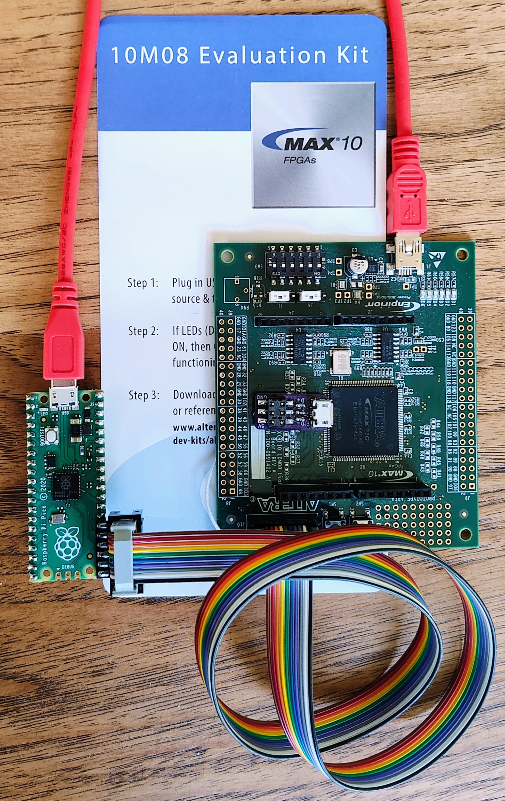

# Pico Dirty Blaster
USB Blaster adapters for [pico-dirtyJtag](https://github.com/phdussud/pico-dirtyJtag)
Also supports [Drag-n-Drop FPGA programming via UF2](https://steieio.github.io/pico-dirty-blaster/uf2jbc.html)
More documentation [available here](https://steieio.github.io/pico-dirty-blaster/)
You can purchase the PCB from [OSH Park](https://oshpark.com/)
 * [Through Hole PCB design at OSH Park](https://oshpark.com/shared_projects/5RjXdQ8y)

