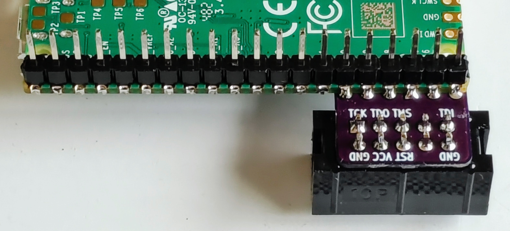

# Pico Dirty Blaster

A USB Blaster alternative based on [PICO-DIRTYJTAG](https://github.com/phdussud/pico-dirtyJtag) and [openFPGALoader](https://trabucayre.github.io/openFPGALoader/)

A [JBC player](./uf2jbc.md) is also available for these boards to allow programming devices from [JBC files](https://www.intel.com/content/www/us/en/programmable/quartushelp/current/index.htm#reference/glossary/def_jbc.htm).

This project includes three PCB variants:
 * Through Hole
 * Surface Mount
 * Level Shift

## Through Hole

This variant has a single 100 mil pitch 10 pin through hole USB Blaster compatible connector on a 600 mill by 500 mil PCB.

## Surface Mount

This variant has a 100 mil pitch 10 pin SMT USB Blaster compatible connector on top, and a 50 mil pitch 10 pin SMT Arm Cortex compatible connector on the back side.  This variant is 600 mil by 600 mil.

## Level Shift

This is a larger variant that includes level shifters to allow for different target voltages.  It has a 100 mil pitch 10 pin SMT USB Blaster compatible connector and a 50 mil pitch 10 pin SMT Arm Cortex compatible connector both on the top side.  It also has a Qwiic connector and RUN button for the PICO board.  This variant is 600 mil by 2000 mil to accomodate the additional features.
